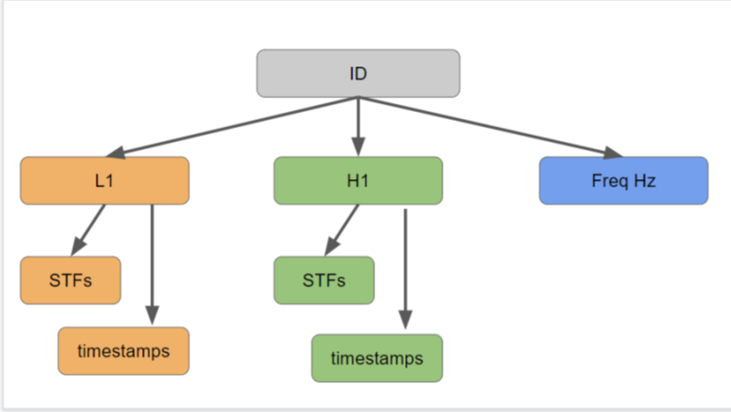
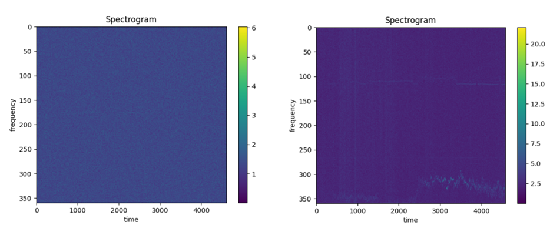
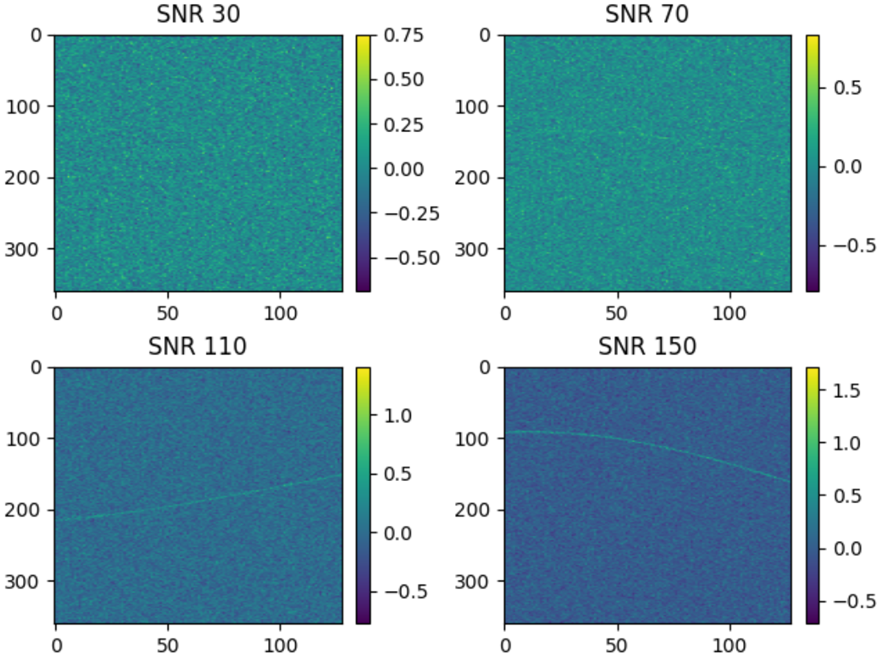

# Compétition Kaggle [G2Net](https://www.kaggle.com/competitions/g2net-detecting-continuous-gravitational-waves)

## Introduction

Ce projet de groupe consiste à participer à la compétition Kaggle sur la détection d'ondes gravitationnelles.  
L'objectif est d'identifier les ondes gravitationnelles continues à partir des données fournies par les observatoires LIGO de Livingston (L1) et Hanford (H1).  

Les ondes gravitationnelles générées lors de la collision de deux astres massifs, comme des étoiles à neutrons ou des trous noirs, sont de forte amplitude.  
Ici, nous nous intéressons à un autre phénomène : deux astres en orbite l'un autour de l'autre, produisant des ondes gravitationnelles continues de plus faible amplitude.  
Le défi est donc d'être capable de les détecter sur des spectrogrammes.

## Structure des données

- **L1** : Interféromètre de Livingston  
- **H1** : Interféromètre de Hanford  
- **STFs** : Données du spectrogramme (fréquence, temps)  
- **Timestamps** : Temps correspondant au spectrogramme en temps GPS  
- **Freq Hz** : Valeurs des fréquences associées au spectrogramme  

Il est important de noter que le jeu d’entraînement est créé à partir de bruit réel provenant d’un interféromètre, ou simulé, auquel un signal d’onde gravitationnelle simulé a été ajouté (ou non).  
En revanche, le jeu de test contient uniquement des mesures réelles.

Exemple de spectrogrammes :
- À gauche : un spectrogramme issu du jeu d'entraînement  
- À droite : un spectrogramme issu du jeu de test  

On observe que le jeu de test, basé sur des données réelles, contient des signaux parasites absents du jeu d’entraînement.

## Traitement des données

- **Jeu d'entraînement** : 400 cas positifs + 200 cas négatifs = **600 observations**  
- **Jeu de test** : **7 975 observations**  

La taille des spectrogrammes est donnée par :  
**(fréquence, timestamp) = (360, [4000-5000])**  

Nous avons fixé le timestamp en tronquant les données à **(360, 4096)**.  
Cela n’a pas d’impact, car l’onde gravitationnelle est continue et non ponctuelle comme lors d’une collision.  

Ensuite, nous avons :  
- Normalisé les données  
- Moyenné les timestamps tous les 32 points afin de réduire la dimension à **(360, 128)**, optimisant ainsi le temps de calcul  
- Vérifié que l’onde gravitationnelle restait visible après transformation  
- Concaténé les spectrogrammes des deux observatoires pour obtenir des données au format **(360, 128, 2)**  
- Sauvegardé ces données prétraitées pour éviter d'effectuer les transformations à chaque entraînement  

💡 *Nous avons essayé de réduire le bruit, mais sans succès.*

## Génération de données

Pour augmenter la taille du jeu d’entraînement, nous avons utilisé une librairie permettant de générer de nouvelles données, avec ou sans ondes gravitationnelles.  
En ajustant les hyperparamètres, nous avons pu moduler le contraste entre le bruit et le signal.

Exemple de données générées avec différents niveaux de contraste.

## Résultats

La métrique utilisée par Kaggle est l'**AUC ROC**. 
En utilisant un modèle préentrainé d'EfficientNetV2S
nous avons obtenu des valeurs supérieures à **0.9** sur notre jeu de validation, mais notre meilleur score sur le jeu de test de Kaggle était **0.69**.

